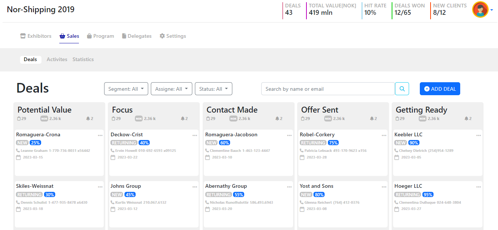
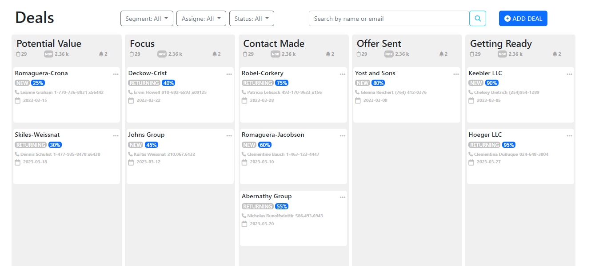
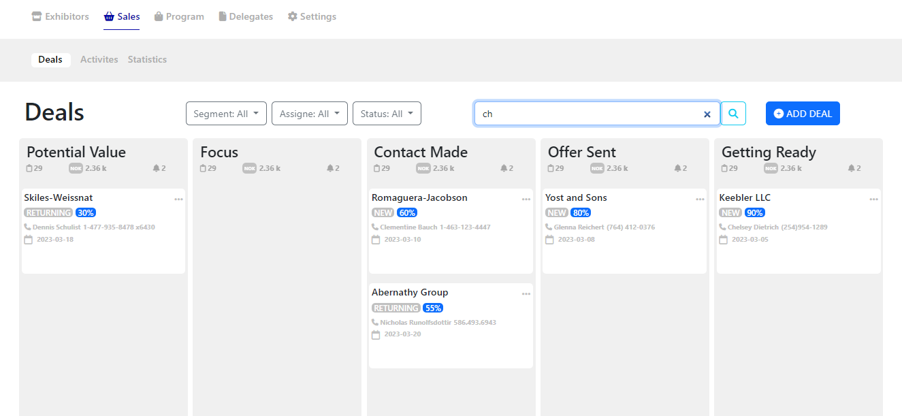
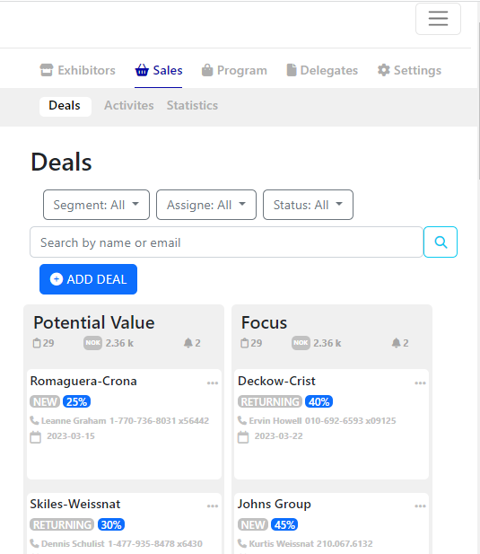

# _ Angular Deals Pipeline Application _ 
#### _This is a Responsive Angular application that fetches deals data from a public CRM Contacts API endpoint and displays it in a visual pipeline divided into five stages. Users can drag and drop deals between the stages. The application also provides a search functionality to search for contacts based on first name, last name, or email._
## Application Structure
#### The application follows a component-based architecture and uses Angular best practices such as dependency injection and observables. The following are the main components:
1.	deal.service - The Service that loads the deals data from the API and passes it to all Component.
2.	deal.component - The component that displays a single deal.
3.	deals.component - The component that displays contains the deal component and allows it to be dragged and dropped between stages.
4.	stage.component - The component that displays the stages of the pipeline and contains the deals component.
5.	search.pipe - The Pipe that provides the search functionality for the deals.
## Installation
#### To run the application, follow these steps:
1.	Clone this repository: git clone https://github.com/selvia-fayez/angular-deals-pipeline.git
2.	Install the dependencies: cd angular-deals-pipeline && npm install
3.	Start the application: npm start
4.	Open the application in your browser: http://localhost:4200

